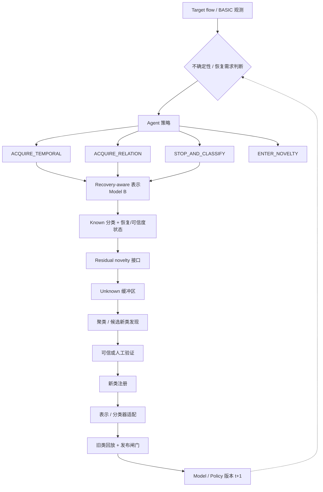

# 组会项目概述 — 面向开放世界恶意流量识别的持续学习与自进化 Agent

**STATUS=REPORTING_REFERENCE**
**SCIENTIFIC_AUTHORITY=false**（本文件是面向导师/组会的沟通参考，不是新的权威文档，也不是冻结实验协议；一切以冻结协议与正式结果 JSON 为准）
**DATE=2026-08-20**

> 阅读提示：本文件面向了解"恶意流量分类 + LLM/Agent + RL/持续改进"大方向、但无需逐条跟进历史调试 Gate 的读者。全文严格区分四种状态：**已实验验证**、**已冻结但未运行**、**计划中**（有前置条件）、**候选创新**（尚未证实）。未验证的未来组件一律不作"已工作"表述。

---

## 1. 项目一句话定义

面向开放世界恶意流量识别的持续学习与自进化 Agent，重点研究动态 Evidence 获取、Recoverable Known 与真实 Novelty 的区分，以及经过验证的新类反馈如何持续改善分类、novelty admission 和决策策略。

当前系统**不是**"全自主无人监督"的承诺：新类进入体系需要聚类 + 可信验证（必要时人工）的闭环，本文按这一边界如实表述。

## 2. 为什么从普通恶意流量分类转向当前问题

普通闭集分类器的隐含假设是：未来所有样本都属于已见类别。但真实流量是演化的：

- 新攻击类会不断出现，闭集假设必然失效；
- 难分的已知样本（hard Known）可能看起来像 Unknown；
- 部分"看似 Unknown"的样本可以通过额外的运行时合法 Evidence 被恢复为 Known；
- 但 Evidence 也有副作用——它可能带来**泛化的 Known 偏向**，让未知样本也变得更"像已知"。

因此真正的问题不是简单的"固定一次观测下区分 Known / Unknown"，而是：

> **在获取了运行时合法 Evidence 之后，这是对一个 Known 样本的可信恢复，还是泛化 Known 偏向掩盖下的真实 Unknown？**

这一转变不是猜测，而是由已完成的实验链条支持的（见第 5 节）。

## 3. 当前整体系统结构



当前核心 Evidence 类型（实验性，已冻结）：

| 类型 | 含义 |
| --- | --- |
| BASIC | 当前流的直接可观测特征（单次观测） |
| TEMPORAL | 严格过去的时序 Evidence（串行化后作为模型输入） |
| RELATION | 严格过去的关系型 Evidence（同一语义约束） |

两点澄清：

1. 这是**当前实验所用的 Evidence 类型**，不代表未来系统只能使用这两种；
2. 长期架构设计为 **Evidence 类型可扩展**，但**不承诺**任意零样本新 Evidence 类型开箱即用——新类型必须走"合法性定义 + 泄漏审计 + 预注册"流程。

## 4. Recoverable Known / Residual Novelty 核心分解

把 Known 集合显式分解为三部分：

```
K = K_basic-sufficient      （BASIC 观测即可分类）
  ∪ K_evidence-recoverable  （需要额外 Evidence 才能恢复）
  ∪ K_residual-hard         （即使获取 Evidence 仍然难分）
```

**为什么这个分解重要**：hard Known 被误判为 Unknown 后，会进入 Unknown 缓冲区，污染聚类与持续学习循环——新类发现和 Known 恢复互相干扰。

**项目目标**：在合法历史 Evidence 支持时，**先恢复本可恢复的 Known**；把真正残余的 unresolved 群体送入 novelty 发现。这样 Unknown 缓冲区收到的才是更纯粹的"候选新类"而非"漏检的已知样本"。

## 5. 已得到的关键实验结论

科学链条（只列直接支撑设计的结论，不逐条罗列历史 Gate 数字）：

| # | 结论 | 一句话证据 |
| --- | --- | --- |
| A | 选择性 Evidence 确实帮助 Known 分类/恢复 | Gate 1B = PASS：条件选择器驱动的获取 9/9 正增益；随机获取有害（Gate 1 = YELLOW，时序适度一致正、关系在冻结 RF 探针下有害） |
| B | **分类恢复 ≠ novelty 恢复** | 开放世界可恢复性 Gate V1 = FAIL：typed Evidence 获取使 recoverable-Known 假未知率（FURK）显著恶化（+0.235 vs direct，9/9 cells，CI [0.082, 0.290]），而 True Unknown 识别未受损——把分类模型分数当作 novelty 分数是瓶颈 |
| C | 基于 MSP 的开世界闸门未能建立最终的 Unknown 增益 | 同上：瓶颈在"获取 Evidence 后的 MSP novelty 打分"，不在路由质量 |
| D | 更强混合 OSR 显示**方法依赖性** | 同一冻结表示下，Mahalanobis 与 EDL 头对同一获取诱导的移动给出相反解读（READOUT_DOMINANT，方法依赖审查） |
| E | SHUFFLED Evidence 复现了大量泛化 Known 偏向 | SHUFFLED→REAL 对比显示 Evidence 存在**泛化分布效应**——即使证据与目标类别无关，也会推高 Known 分数 |
| F | **信息充分性 Gate 最终确立**（POSTRUN_VALIDATION=PASS） | RAW 合法 Evidence 中：REAL 显著 > BASIC、REAL 显著 > SHUFFLED、3/3 RAW 探针家族支持目标特异信号、跨轮转一致；但当前 STATE_TRANSITION 抽象只保留其中很小一部分（median ret_b ≈ 0.020 / ret_s ≈ 0.083）；Known-only 的开世界迁移仍失败（n_B_RAW=0） |

**结论动机**：RAW 合法 Evidence 里**存在**有用的目标特异恢复信息；当前瓶颈在**表示 + 开世界迁移**，而不是"信息不存在"。这正是 Model B 立项的依据（MODEL_B_DESIGN_JUSTIFIED=true）。

## 6. 当前 Model B 的具体结构（已冻结，未运行）

Model B V1 已冻结并预注册（`FROZEN_DESIGN_NOT_RUN`），**尚未开始任何正式训练**。

- **骨干**：Qwen3.5-9B，冻结基座权重（bf16 驻留 ~16.8GB）；
- **LoRA**：r=16, alpha=32, dropout=0.05, bias=none，作用于 9 个投影目标（q/k/v/o_proj、gate/up/down_proj、in_proj_qkv/out_proj），可训练参数 ~42M；
- **输入**：结构化固定串行化的 typed 输入块——TARGET / TEMPORAL / RELATION 三块（m=0 表示该状态无 Evidence）；
- **表示**：最后一层隐藏状态 → TARGET 内容 token 均值池化 h_t → Evidence 内容 token 均值池化 h_e → 投影 u=W_u·h_t、v=W_v·h_e（4096→256）→ 导出向量 e=concat(u,v)∈R^512；
- **两个头**：① K=6 Known 分类头（Unknown 仅评估用，不是第 K+1 类）；② 目标–Evidence 对应/可信度头；
- **训练目标**：L = L_CE + L_CORR，其中 L_CORR 用 softplus(−(s_real − s_matched_shuffled))，s 为余弦相似度——**正样本**：目标 i 与其自身 Evidence 的对应；**匹配负样本**（MATCHED_SHUFFLED_TRAIN）：同一类别、同一状态、不同活动组、不同行的另一条样本的 Evidence（确定性一个负样本/正样本；Unknown 永不作为负样本）；
- **对照实验**（科学控制核心）：QWEN_CE_ONLY vs QWEN_CE_PLUS_CORR——**同一模型、同一 LoRA、同一数据、同一预算**，唯一差别是是否加入 correspondence 目标；
- 另设 non-Qwen 基线 D（6 层 transformer 编码器、字符级冻结 tokenizer、e∈R^256、~19M 参数、同一配方），3 轮转 × 3 目标 = 9 个 fit。

**为什么这个对照重要**：我们需要知道增益来自"显式的目标–Evidence 对应学习"，还是仅仅来自"用了更大的模型"。CE_ONLY vs CE_PLUS_CORR 正是回答这一问题的冻结实验。

## 7. "Evidence 会把所有样本推向 Known"这一问题

**准确的表述是**：Evidence 包含两个可分离的成分——

1. **泛化分布成分**（generic distribution component）：即使证据与目标类别无关，也会让分数向 Known 移动；
2. **目标特异对应成分**（target-specific correspondence component）：证据与目标类别之间存在可用的特异对应信息。

**证据支持的解读**（不是"Evidence 永远把每条流推向 Known"）：

- SHUFFLED 实验表明泛化成分确实存在（E 结论）；
- REAL-over-SHUFFLED 的显著差异表明目标特异信息确实存在（F 结论）；
- **Model B 的目标**是保留并利用目标特异对应，而不是放大泛化的 Evidence 诱导 Known 性。

这是 Model B 立项的核心科学动机之一。

## 8. RL 在项目中的具体位置

RL 在本项目中**不是**"RL 训练所有模块"。RL 被精确定义为**顺序决策 / 信息价值（value-of-information）策略**。

- **状态 s_t** 可包含：表示 h/e；Known 类概率或间隔；不确定性；恢复/可信度分数；Evidence mask；获取历史；剩余成本/预算；novelty 相关状态。
- **动作**：STOP_AND_CLASSIFY / ACQUIRE_TEMPORAL / ACQUIRE_RELATION / ENTER_NOVELTY。未来可能扩展 Evidence 类型动作，但 V1 动作空间**不自动动态化**。
- **奖励**（应基于最终任务结果与成本，例如）：
  - 正确终局决策奖励；
  - − 错误恢复惩罚（把真 Unknown 判成 Known）；
  - − 假未知惩罚（把 Known 判成 Unknown）；
  - − Known 误分类惩罚；
  - − Evidence 获取成本。

**明确禁止**：奖励原始置信度或 Known 向移动——我们的实验已经证明泛化 Evidence 可以在没有真实恢复的情况下抬高表观 Known 性（第 7 节）。

**RL 的预期贡献**：学习"何时值得获取额外 Evidence、何时停止、何时把样本送入 novelty 处理"。

**诚实前提**：RL 只有在**顺序/非短视价值**被实验证实后才立项（当前 V2 分析：顺序决策理由 PLAUSIBLE 但 RL_REQUIRED=false）。如果贪婪/监督路由效果相当，就**不应声称 RL 是必要的**。

## 9. 自进化 / 持续学习如何体现

分两个时间尺度：

- **FAST（快尺度）**：逐流的观测/动作策略（Agent 决定获取什么 Evidence、何时分类、何时进入 novelty）。
- **SLOW（慢尺度）**：Unknown 缓冲区 → 聚类 → 验证 → 类注册 → 监督/持续适配 → 旧类回放 + 发布闸门。

**候选的更高级自进化机制**（计划中，未演示）：被验证的未来新类结果可以**事后标注先前的轨迹**，例如：

- 例 1：Evidence 获取导致置信上升、Agent 判为 Known；后来的聚类验证显示这其实是一个新类 → 该轨迹成为**错误恢复学习信号**；
- 例 2：Agent 进入 novelty；后被验证为新攻击 → **正面的策略反馈**。

由此形成策略版本序列：π₀ → π₁ → π₂ → …

**评估方式**：考核后续策略/模型版本在**未来未见类**上的表现是否提升，而不只是在已注册类上的表现。

以上保持"计划/候选"定位，**不是已演示结果**。

## 10. 与已有工作的主要差异 / 创新边界

**明确不属于我们的 novelty**：

- open-set / OOD 检测本身；
- "Evidence 帮助 Known/Unknown"本身；
- Mahalanobis 距离；
- evidential uncertainty（EDL）；
- contrastive learning；
- active feature acquisition；
- Unknown 聚类；
- class-incremental learning；
- 泛化 continual learning；
- 仅仅使用 Qwen；
- 仅仅使用 RL。

**相关 prior-art 族**：AFA / RL 获取决策；open-set 流量识别；evidential uncertainty；contrastive / center-aware 流量表示；unknown 聚类 / 新类发现；continual / open-world 流量学习。文献审计已完成（RoNeTC / RoeCi / GCLC 全文核读为外部 researcher workflow 完成，ACO ICML 2024 方法级核读 PENDING，不阻塞实证 Gate，最终 novelty 声明前必须完成）。

**当前候选差异点**（"当前候选贡献边界"措辞，不使用"首次"）：

1. **运行时合法的严格过去 typed Evidence 获取**——获取的是此前未观测的观测证据（对比 RoeCi 对同一观测加容量/算力）；
2. **显式的 Recoverable Known vs Residual Novelty 分解**；
3. **恢复感知表示**——区分"目标特异可信恢复"与"泛化 Evidence 诱导的 Known 向移动"；
4. **未来反馈闭环**——被验证的新类结果不仅改善分类器 taxonomy，还改善 Evidence 获取 / novelty admission 策略。

## 11. 计划中的完整研究阶段

| 阶段 | 内容 | 状态 |
| --- | --- | --- |
| 1 | 信息可行性（信息充分性 Gate：RAW 中存在目标特异恢复信息） | **COMPLETE** |
| 2 | Model B 恢复感知表示（frozen：Qwen LoRA + CE/CORR 对照 + 基线 D） | **FROZEN, NOT RUN** |
| 3 | 恢复感知 novelty 接口 | 计划中，**仅当阶段 2 证明其合理性** |
| 4 | RL Evidence 获取 / 停止 / novelty admission | 计划中，**仅当顺序价值被证实** |
| 5 | Unknown 聚类 + 被验证的新类注册 | 计划中 |
| 6 | 多轮 continual / 自进化评估 | 计划中 |
| 7 | 外部 / 多数据集鲁棒性 | 资源与时间允许时 |

**门控哲学**：不在更早机制被验证之前叠加 RL / continual 模块。

## 12. 预期论文贡献

以 **CANDIDATE** 形式呈现，不是最终 claim：

| 贡献 | 内容 | 状态 |
| --- | --- | --- |
| C1 | 恢复感知的开世界问题设定（Recoverable Known 与 Residual Novelty 的显式分解） | **SUPPORTED**（信息充分性结果支撑该设定） |
| C2 | 目标–Evidence 对应表示：区分真实恢复与泛化 Evidence 诱导 Known 性 | **CURRENTLY UNDER TEST**（Model B 已冻结，未运行） |
| C3 | 成本感知的顺序 Evidence / novelty admission 策略 | **FUTURE CANDIDATE**（仅当 RL 相对非 RL 基线展现出价值） |
| C4 | 被验证反馈驱动的跨多轮未见类策略/模型演化 | **FUTURE CANDIDATE**（仅当后续 continual 实验成功） |

## 13. 老师可能会问的问题（FAQ / 谈点）

**Q1：为什么需要 LLM/Qwen，不直接用 RF/MLP？**
不是"用更大的模型"本身：Qwen 的冻结语义表示承接 typed 串行化输入（TARGET/TEMPORAL/RELATION 三块），且 CE_ONLY vs CE_PLUS_CORR 对照专门检验"增益来自 correspondence 目标还是仅来自模型容量"；基线 D（~19M 参数同配方 transformer）提供容量对照。

**Q2：为什么 Evidence 只有 T/R 两种？**
它们是当前数据集冻结的运行时合法 Evidence 类型，且经过严格过去性 + 泄漏审计。架构设计为可扩展，但新类型必须走合法性定义、泄漏审计与预注册流程，不承诺任意零样本新类型。

**Q3：Evidence 会不会让 Unknown 变得更像 Known？**
会——泛化成分确实存在（SHUFFLED 复现了大量 Known 向移动）。所以问题不是"有没有"，而是"目标特异成分是否存在且能否被表示分离"；Model B 的核心动机就是做这件事，并以此支撑恢复/可信度判断。

**Q4：为什么要 RL？**
因为获取决策是顺序的：要不要再花成本获取 Evidence、要不要停下分类、要不要送 novelty——这是 value-of-information 问题。但 RL 只在顺序/非短视价值被证实后立项；贪婪/监督路由效果相当的话就不声称 RL 必要。

**Q5：RL 和分类器/聚类器分别负责什么？**
RL（顺序策略）负责"何时获取 / 何时停止 / 何时 admission"；分类器负责"判哪一类"；聚类器负责"候选新类的结构化发现"。三者职责分离，RL 不接管分类与聚类本身。

**Q6：新攻击来了以后系统如何学习？**
慢尺度闭环：Unknown 缓冲 → 聚类 → 验证（必要时人工）→ 类注册 → 表示/分类器适配 → 旧类回放 + 发布闸门；被验证的轨迹再回授给获取/admission 策略（候选机制）。

**Q7：新 Evidence 类型以后能不能扩展？**
架构上可以扩展；每个新类型都需要合法性定义、泄漏审计与预注册。V1 动作空间不自动动态化。

**Q8：目前真正已经验证了什么？**
（a）选择性 Evidence 有助于 Known 分类/恢复；（b）分类恢复 ≠ novelty 恢复（MSP 开世界 FAIL）；（c）方法依赖（Mahalanobis/EDL 对同一移动解读相反）；（d）RAW 合法 Evidence 中存在目标特异恢复信息（REAL > BASIC、REAL > SHUFFLED，3/3 家族，轮转一致），但当前 ST 抽象保留很少（~2%），Known-only 迁移未解决。

**Q9：目前最大的未解决问题是什么？**
在保留目标特异对应信息的同时获得 Known 侧的恢复能力与开世界迁移——Model B 正是为它冻结的；其后的 novelty 接口、RL 与 continual 都有严格前置条件。

**Q10：论文的创新和已有 open-world/continual 方法有什么区别？**
候选边界是四条：严格过去 typed Evidence 获取（对比 RoeCi 同观测加算力）、显式 Recoverable Known vs Residual Novelty 分解、区分"可信恢复"与"泛化 Known 向"的恢复感知表示、以及被验证新类结果对获取/admission 策略的反馈闭环。均以候选措辞表述，不声称"首次"。

---

## 附：当前科学检查点（冻结事实）

```text
RECOVERABILITY_INFORMATION_SUFFICIENCY_GATE_V1=REPRESENTATION_BOTTLENECK_SUPPORTED
POSTRUN_VALIDATION=PASS
MODEL_B_V1_STATUS=FROZEN_DESIGN_NOT_RUN
MODEL_B_FORMAL_TRAINING_STARTED=false
MODEL_B_PROTOCOL_SHA256=3479f1a5eb1027452a5dea9152ebf4a82a55b27572905fbfa84097431f665576
```

权威细节见 `docs/research_plan/model_b_recovery_aware_representation_v1_protocol.md`（冻结协议）与 `reports/research_audit/recoverability_information_sufficiency_gate_v1_result.json`（正式结果）。
