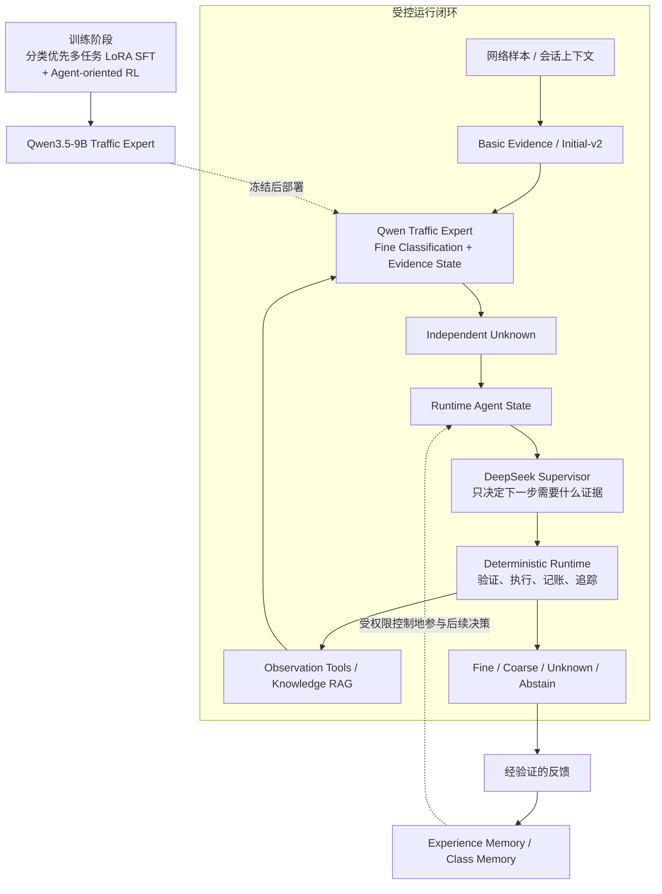
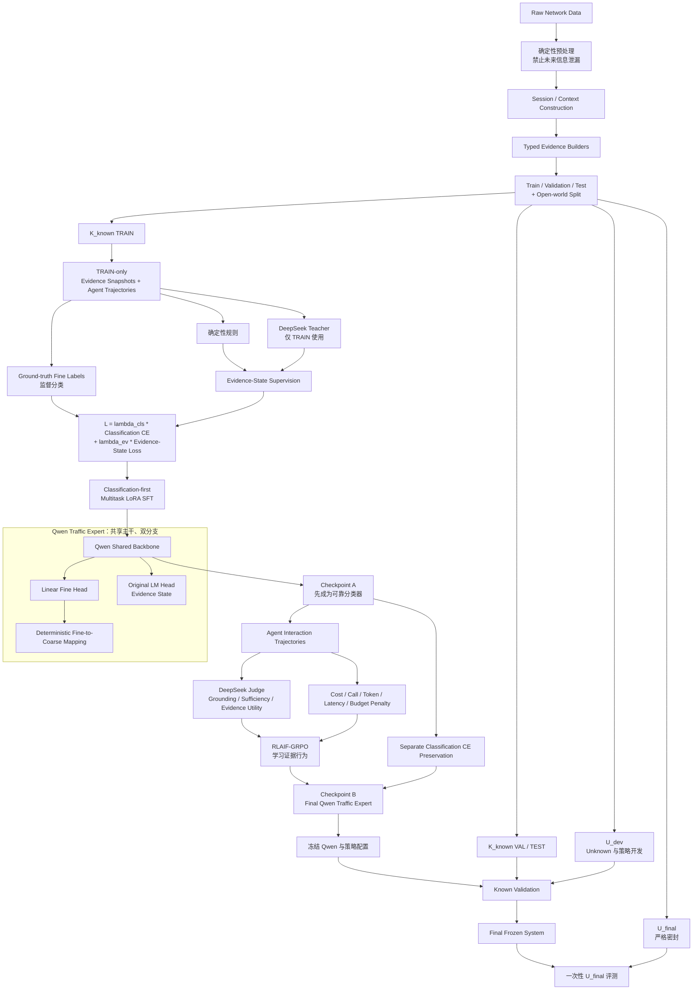
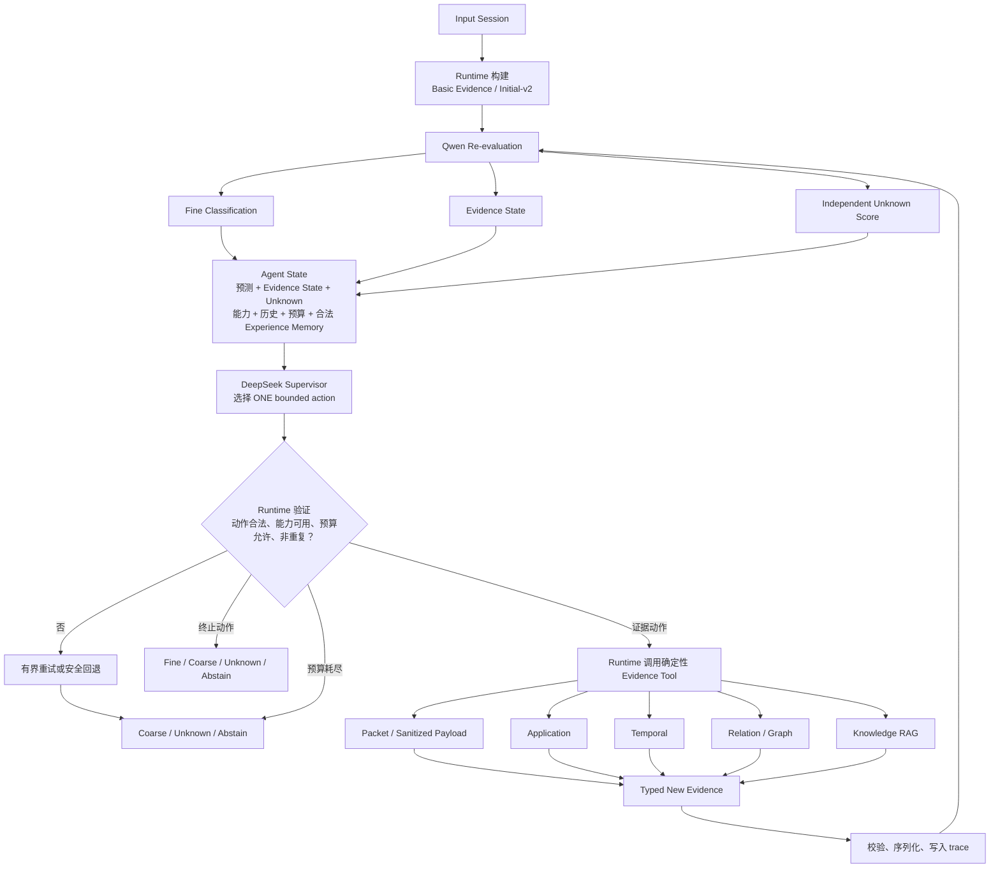
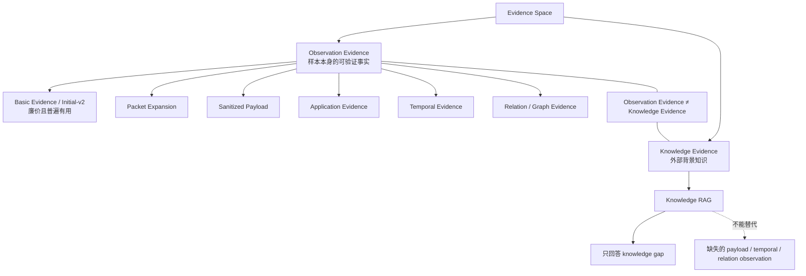
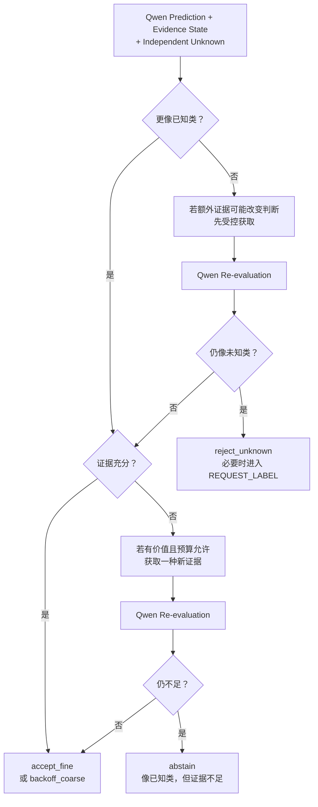
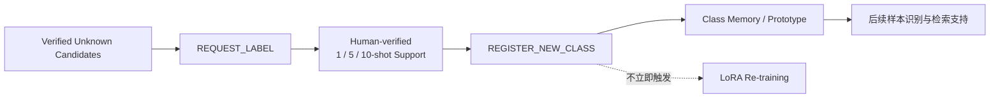
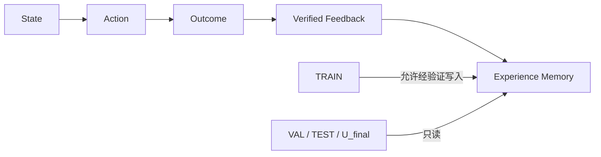
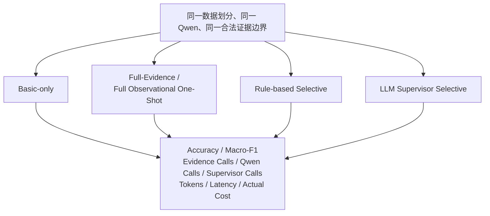

# 基于自适应证据获取的恶意流量分类与开放世界识别框架

本文用于 5–10 分钟研究汇报，以图为主说明已经冻结的方法结构：先由 **Qwen3.5-9B Traffic Expert** 完成流量细分类与证据状态判断，再由 **DeepSeek Evidence Acquisition Supervisor** 在确定性 Runtime 约束下按需获取证据。本文是三份正式研究计划的派生视图，不替代原计划，也不把尚未完成的实验写成既成结果。

> **当前边界**：`Basic Evidence / Initial-v2` 表示“廉价且普遍有用的初始网络证据”；其精确字段仍待 Evidence audit 后冻结。正式 SFT、Agent-oriented RL、Unknown 校准与对照实验仍是待执行研究流程。

## 1. 一图总览：训练、运行与开放世界闭环

核心分工只有三句话：

1. **Qwen 判断类别与当前证据是否足够**，不选择工具。
2. **Supervisor 选择一个有界动作**，不直接分类、不读取原始 PCAP、不执行 shell。
3. **Runtime 决定动作能否以及如何执行**，并把新证据重新送回 Qwen。

---

## 2. Training Pipeline：从原始流量到最终模型

### 2.1 模型与监督边界

- 共享 Qwen backbone 只分出 **Linear Fine Head** 与原始 **LM Head / Evidence State**；不存在单独的 Coarse Head，粗类由细类确定性映射得到。
- Fine label 的 Ground Truth 监督 Classification CE；确定性规则与 TRAIN-only Teacher 监督 Evidence State。分类正确性与证据充分性是两个不同学习目标。
- 总损失为 `L = λ_cls × Classification CE + λ_ev × Evidence-State Loss`。Teacher 判断“证据不足”不会自动屏蔽主分类 CE；只有监督契约明确规定的受控辅助状态才可使用相应 mask。
- GRPO 学习的是“何时停止、何时获取、获取哪一种、避免重复、控制成本”。Fine 分类正确性不作为 group-relative reward 重新学习，而由并行的 Classification CE preservation 保持。
- `U_final` 不参与训练、调参、提示词选择、Unknown 阈值校准或策略选择；系统完全冻结后才允许一次性评测。

### 2.2 Qwen 输出的 Evidence State

Qwen 每轮同时输出 Fine 分类结果与结构化 Evidence State：

| 字段 | 含义 |
|---|---|
| `supporting_evidence` | 当前哪些观测支持预测 |
| `missing_evidence` | 尚缺哪些证据 |
| `evidence_sufficient` | 当前证据是否足够支撑停止 |
| `gap_type` | 缺口属于 packet、payload、application、temporal、relation 或 knowledge |

Qwen 不输出工具选择，不读取原始数据集、抓包文件、Ground Truth 或未来窗口。

---

## 3. Runtime Loop：证据获取智能体如何运行

### 3.1 当前 Runtime 的动作契约

以下名称与当前仓库 `AgentAction` schema 保持一致：

| 动作类别 | 当前动作名 | 语义 |
|---|---|---|
| 获取观测 | `expand_packets` | 扩展受控 packet-level 观测 |
| 获取观测 | `expand_temporal_context` | 扩展历史时间窗口 |
| 获取观测 | `expand_graph_context` | 扩展主机 / 流关系图上下文 |
| 获取观测 | `request_application_evidence` | 请求确定性 application-level 证据；不可用时 fail closed |
| 获取知识 | `retrieve_knowledge` | 仅在 knowledge gap 时检索背景知识 |
| 终止 | `accept_fine` | 接受细分类 |
| 终止 | `backoff_coarse` | 回退到确定性粗分类 |
| 终止 | `reject_unknown` | 拒识为 Unknown |
| 终止 | `abstain` | 证据不足或预算耗尽时弃权 |

**Sanitized Payload** 是已经确认需要的受控 Observation 能力，但其独立正式 action 名称与精确 schema 仍待 Evidence audit 后冻结；本文不把它伪装成已有 `AgentAction`。`REQUEST_LABEL` 与 `REGISTER_NEW_CLASS` 属于第 5 节的人类验证新类注册流程，也不伪装成当前单轮 Runtime 动作。

### 3.2 Runtime 拥有最终执行权

Runtime 负责验证动作白名单、工具可用性、预算、最大轮数、重复动作、未来泄漏边界、确定性提取、schema 校验、序列化、失败回退与完整 trace。Supervisor 只回答“下一步需要什么”，Runtime 决定“是否允许、如何执行”；每份新增证据都必须回到 Qwen 重新分类和重估 Evidence State。

DeepSeek Supervisor 只能看到 Runtime 组装的 Agent State。它不能直接给出 Fine label，不能读取 PCAP 或数据集文件，不能运行 shell，也不能自行修改证据或 Memory。

---

## 4. Evidence Architecture：Observation 与 Knowledge 严格分域

- **Basic Evidence / Initial-v2**：价格低、覆盖广、每个样本首先可得；确切字段尚未冻结。
- **Packet / Sanitized Payload / Application**：补充单流内部的协议、内容或应用层事实，必须经过确定性清洗和字段约束。
- **Temporal**：补充同一实体或相关流在历史窗口中的速率、重复性、突发性等行为事实；禁止读取未来窗口。
- **Relation / Graph**：补充主机、会话、端点之间的关系事实。
- **Knowledge RAG**：提供协议、漏洞、攻击模式等背景知识；只在 `gap_type = knowledge` 时有意义。

下表只是“哪类证据可能更有价值”的研究直觉，不是硬编码的类别到工具路由：

| 场景示例 | 可能更有价值的证据 | 为什么只是示例 |
|---|---|---|
| SQL injection | Sanitized Payload、Application | 是否请求仍由 Evidence State、能力与预算共同决定 |
| DDoS | Temporal | 单流外的速率与重复模式可能关键 |
| MITM | Relation / Graph | 多实体关系可能比单包特征更有辨识力 |
| Scanning | Temporal、Relation / Graph | 需要观察跨端口或跨目标模式时才有价值 |

---

## 5. Open-world Decision、Memory 与新类注册

### 5.1 Unknown 与 Abstain 是两种不同结论

- **Unknown**：系统认为样本不属于当前已知类别空间。
- **Abstain**：样本可能属于已知类，但现有合法证据不足以做可靠判断，或预算已经耗尽。

### 5.2 新类注册不等于立即重新 LoRA

`REQUEST_LABEL` 与 `REGISTER_NEW_CLASS` 是带人工验证的开放世界生命周期动作；少样本支持集先形成 Class Memory / prototype，后续是否重训必须由独立实验与版本流程决定。

### 5.3 三种 Memory 不混用

| 组件 | 保存什么 | 可否作为标签真值 |
|---|---|---|
| Knowledge RAG | 协议、漏洞与攻击模式等外部背景知识 | 否；也不能补造缺失观测 |
| Experience Memory | `State -> Action -> Outcome -> Verified Feedback` 的决策经验 | 只有经验证反馈可写入；Supervisor 自己的预测不能自证 |
| Class Memory | 人工验证的新类支持样本、prototype 与类别描述 | 可辅助后续识别，但不等于立即参数更新 |

---

## 6. Why Agent：必须用完整观测基线证明必要性

核心研究问题不是“Agent 能不能调用工具”，而是：**在保持或提高分类效果的同时，按需证据获取能否节省证据提取、模型调用、token、延迟和实际成本？**

`Full-Evidence / Full Observational One-Shot` 是不可缺少的上界与必要性基线。如果完整合法观测一次性输入具有相同或更高准确率，同时成本更低，那么当前 Agent 设计就没有被实验结果证明为必要；这一结果必须被如实报告。

建议主表同时报告：Accuracy、Macro-F1、每样本 Evidence calls、Qwen calls、Supervisor calls、输入 / 输出 tokens、端到端 latency 与实际货币成本，并按已知类、Unknown、Abstain 及证据分支给出分层结果。

---

## 7. 角色—职责—禁止事项

| 角色 | 唯一职责 | 可以 | 明确禁止 |
|---|---|---|---|
| Qwen3.5-9B Traffic Expert | 细分类与 Evidence State | 输出 Fine、证据支持 / 缺口 / 充分性；经确定性映射得到 Coarse | 选工具、读原始 PCAP / 数据集 / GT / 未来窗口 |
| Independent Unknown | 已知空间外拒识 | 基于冻结模型输出与校准规则给出 Unknown 证据 | 把证据不足自动等同 Unknown |
| DeepSeek Teacher | TRAIN-only Evidence State 教师 | 与确定性规则共同构建训练监督 | 进入 VAL / TEST / U_final，替代 GT 细分类标签 |
| DeepSeek Judge | 评估 Agent 证据行为 | 评价 grounding、sufficiency、evidence utility 与成本 | 用 group-relative fine-label reward 重写分类目标 |
| DeepSeek Supervisor | Evidence Acquisition Supervisor | 看 Agent State，在固定集合中选择一个动作 | 直接分类、抓包、执行 shell、修改 Evidence / Memory |
| Deterministic Runtime | 权限与执行边界 | 验证、提取、序列化、预算、去重、失败处理、trace | 绕过 schema 或放宽未来泄漏边界 |
| Observation Tools | 提取样本事实 | 生成 typed packet / payload / application / temporal / relation evidence | 生成背景知识或臆造不可观测事实 |
| Knowledge RAG | 补充背景知识 | 回答 knowledge gap | 替代缺失的 Observation evidence |
| Experience Memory | 保存经验证的动作经验 | TRAIN 写入，VAL / TEST / U_final 只读 | 让 Supervisor 预测自我确认 |
| Class Memory | 保存人工验证的新类支持 | 1 / 5 / 10-shot prototype 与后续检索 | 无人工验证自动注册，或立即触发 LoRA |

---

## 8. 当前正在验证、尚未冻结的三件事

1. **Basic-v2 最终组成**：只冻结“廉价且普遍有用的初始网络证据”这一功能定位；精确字段要经 Evidence audit 与泄漏检查后再定。
2. **弱可观测类别的合法上下文**：明确哪些类别确实需要 payload、application、temporal 或 relation evidence，以及这些观测在现实部署中是否合法、可复现。
3. **Full vs Selective 的准确率—成本关系**：用 Full-Evidence / Full Observational One-Shot 与 Rule / LLM Selective 做同条件对照，判断 Agent 是否真正提供效率收益。

这三项是当前实验验证问题，不改变已经冻结的角色分工、双头 Qwen、独立 Unknown、Runtime 权限边界、Observation / Knowledge 分域以及 `U_final` 严格隔离原则。
